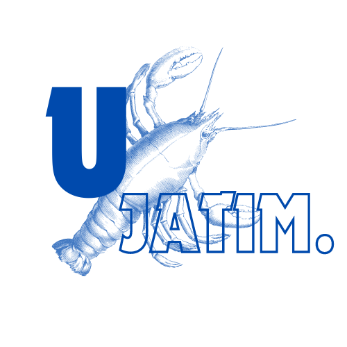

# UJATIM

  

<i>Logo UJATIM (Udang Jawa Timur)</i>

# Pengenalan 🦐

UJATIM atau Udang Jawa Timur merupakan platform inovatif yang didedikasikan untuk memprediksi harga udang vaname di Provinsi Jawa Timur. Platform ini hadir untuk membantu para petani udang vanname dalam memprediksi harga sehingga dapat lebih efisien dalam mengatur pasokan mereka. Dengan demikian, diharapkan dapat memenuhi permintaan dan memaksimalkan keuntungan.

# Latar Belakang 💡

Meskipun harga udang sangat dipengaruhi oleh berbagai faktor seperti waktu, ukuran, dan lokasi, belum ada pendekatan sistematis yang mampu memprediksi harga udang dengan akurasi yang memadai di berbagai wilayah dan periode waktu. Hal ini menciptakan tantangan bagi petani, pedagang, dan pemerintah dalam memahami tren pasar dan mengantisipasi perubahan harga. Information historis yang ada saat ini belum dimanfaatkan secara maksimal untuk membantu dalam pengambilan keputusan yang lebih baik terkait harga udang, terutama dengan adanya variasi di tiap provinsi. Menurut Badan Pusat Statistik (BPS) Tahun 2022, Jawa Timur menjadi provinsi ke-3 di Indonesia sebagai produsen udang vaname terbesar. Di dukung dengan platform https://jala.tech/id yang di akses pada 20 September 2024, menunjukkan bahwa Provinsi Jawa Timur berada di urutan ke-1 sebagai provinsi dengan perbaruan harga udang terurutin dibandingkan provinsi-provinsi lainnya. Dengan perbaruan yang lebih rutin tersebut, diasumsikan bahwa petani udang vaname di Provinsi Jawa Timur cenderung lebih optimal dalam menerapkan teknologi di era digital. Dengan demikian, Provinsi Jawa Timur menjadi studi kasus pada proyek ini. 
Time series atau deret waktu merupakan pengamatan satu atau beberapa
variabel yang diambil secara beruntun terhadap interval waktu yang tetap (Wei,2006). Pada tahun 1976 George Box dan Gwilyn Jenkins memperkenalkan
analisis time series untuk pertama kalinya. Analisis time series adalah salah satu prosedur statistika yang digunakan pada peramalan kejadian di masa depan. Dengan analisis time series tersebut diharapkan dapat memprediksi harga udang vaname di Provinsi Jawa Timur sehingga petani dapat lebih efisien dalam mengatur pasokan mereka dan tentunya dapat memenuhi permintaan dan memaksimalkan keuntungan.

# Tujuan 💫

Tujuan dari proyek ini yaitu:
1. Mengetahui distribusi harga udang vaname di Provinsi Jawa Timur 
2. Dengan memanfaatkan data historis mengenai waktu, ukuran, dan harga diharapkan dapat memprediksi harga udang di masa depan.
3. Membantu petani, pedagang, dan pengelola rantai pasokan dalam mengambil keputusan yang lebih baik terkait harga jual dan stok.
4. Mengungkap pola dalam fluktuasi harga yang mungkin tidak terlihat oleh pengamatan manual, sehingga memberikan wawasan lebih dalam tentang dinamika pasar udang.

# Batasan Masalah 🛑

Batasan masalah yang terdapat pada proyek ini adalah sebagai berikut: 
1. Proyek berfokus pada harga udang vaname di Provinsi Jawa Timur 
2. Udang vaname dengan size 30 s/d 100 digunakan pada proyek ini. Hal tersebut berdasarkan https://jala.tech/id yang di akses pada 20 September 2024, yang mana udang dengan size 30 s/d 100 sudah memiliki nilai ekonomi yang baik dan cukup banyak dicari oleh pembeli di pasaran. 

# Kesimpulan 💌

UJATIM hadir sebagai platform inovatif yang didedikasikan untuk memprediksi harga udang vaname di Provinsi Jawa Timur, dengan tujuan mendukung pengambilan keputusan yang lebih baik di seluruh rantai pasokan, meningkatkan efisiensi, serta memaksimalkan keuntungan bagi petani dan pelaku pasar. Berdasarkan hasil Model ARIMA, yang terbukti menjadi model terbaik dengan MAPE berkisar antara 1% hingga 6% pada berbagai ukuran atau size udang, prediksi harga udang vaname yang dihasilkan oleh platform ini dapat diandalkan untuk mengoptimalkan strategi di seluruh rantai pasokan di Provinsi Jawa Timur.

# Penyusun 👤
1. Asyam Rafif Rizqullah (Data Engineer)
2. Dery Rai Ambhara (Data Scientist)
3. Fahmi Aziz (Data Scientist)
4. Muhammad Asril Hanif (Data Engineer)
5. Shinta Amalia (Data Analyst)

# URL Deployments & Model 🏴
- URL Deployment : https://huggingface.co/spaces/AsrilHanif/UJATIM
- URL Model : https://github.com/AsrilHanif699/UJATIM-MODEL
